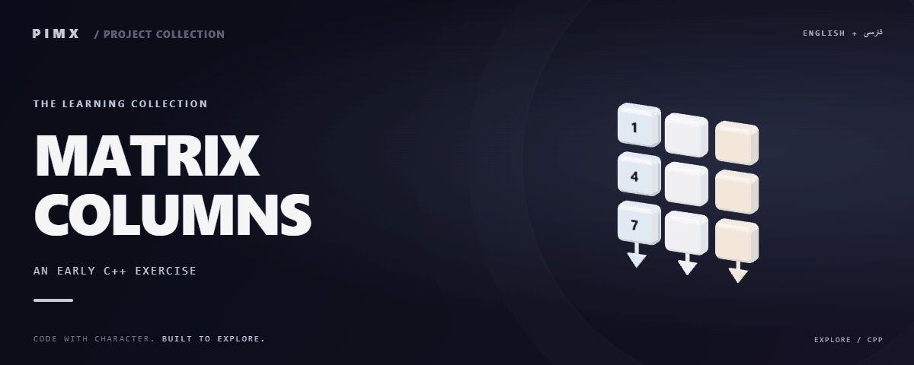

<div align="center">



**[English](README.md) · [فارسی](README.fa.md)**

</div>

# 🔢 MATRIX COLUMNS

A C++ program that reads a 3×3 integer matrix, separates its columns into arrays and prints column values in sequence.

[GitHub](https://github.com/MOHAMMADREZAABEDINPOOR/cpp) · [PIMX / Profile](https://github.com/MOHAMMADREZAABEDINPOOR) · [Static artwork](assets/readme/hero.png)

| At a glance | Details |
|:---|:---|
| 🔢 Experience | Learning exercise / source archive |
| 🧰 Built with | `C++` |
| 🌐 Documentation | [English](README.md) · [فارسی](README.fa.md) |

[✨ Features](#features) · [🚀 Getting started](#getting-started) · [⚙️ Configuration](#configuration) · [🌍 Deployment](#deployment)

---

<a id="features"></a>

## ✨ Features

| Area | Included capability |
|:---|:---|
| 🔢 Logic | 3×3 input matrix |
| ⚡ Workflow | Three column arrays |
| ⚡ Workflow | Nested-loop traversal |

<a id="stack"></a>

## 🧰 Stack

| Tool | Version / source |
|---|---|
| C++ | `standard library` |

<a id="getting-started"></a>

## 🚀 Getting started

A C++ compiler such as GCC, Clang or MSVC. The commands below use g++.

```bash
git clone https://github.com/MOHAMMADREZAABEDINPOOR/cpp.git
cd cpp

g++ m/main.cpp -o matrix-columns
./matrix-columns
```

<a id="configuration"></a>

## ⚙️ Configuration

No standard environment template is defined. Standalone exercises need no external configuration; inspect any service constants or paths in the source before running.

<a id="usage"></a>

## 🎯 Usage

Compile m/main.cpp and provide nine integer values in row order. Output lists the first, second and third columns.

<a id="project-structure"></a>

## 🗂️ Project structure

| Path | Role |
|---|---|
| [`assets/`](assets/) | Brand/media/README assets |
| [`m/`](m/) | Exercise content |

<a id="commands-and-checks"></a>

## 🧪 Commands and checks

No automated test command is declared in a manifest. Verify behavior through a local example run.

<a id="deployment"></a>

## 🌍 Deployment

This is a local learning exercise, not a public service. Browser exercises can use static hosting.

<a id="limitations"></a>

## 📌 Limitations

Input failures and matrix sizes other than 3×3 are not handled.

<a id="troubleshooting"></a>

## 🛠️ Troubleshooting

- Compiler unavailable: install GCC/Clang/MSVC and adapt the example command.
- Missing output: inspect hardcoded paths, drive permissions and input values.

<a id="contributing"></a>

## 🤝 Contributing

Create a focused branch, verify the affected behavior and explain the change clearly. Keep private data, build outputs and local databases out of commits.

<a id="license"></a>

## 📄 License

No repository-level license file is included in this snapshot. Public visibility alone does not grant reuse rights; contact the repository owner for terms.

---

Part of **PIMX** · Documentation in English and Persian.

---

<div align="center">

🔢 **MATRIX COLUMNS** · [English](README.md) · [فارسی](README.fa.md)

</div>
